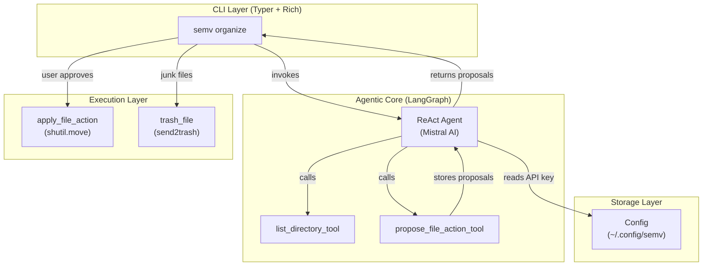
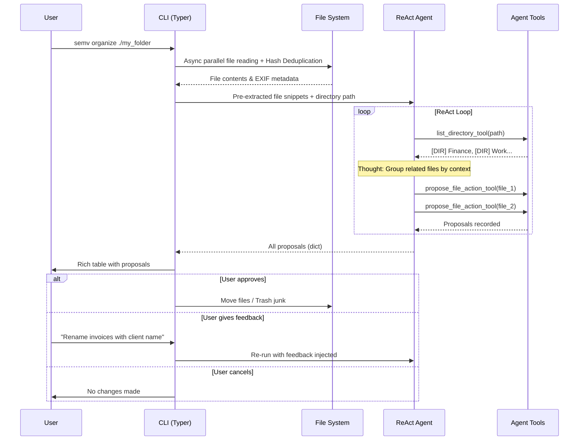
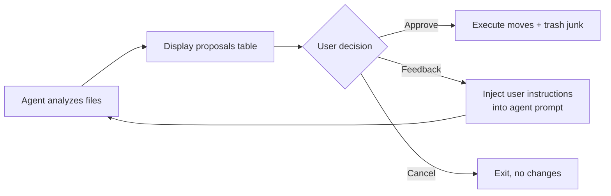

# semv — Semantic File Organizer

An agentic command-line tool that reads file contents (text, code, PDF), understands them semantically, and proposes intelligent organization — renaming, categorizing into folders, and cleaning up junk. Powered by a **LangGraph ReAct agent** with Mistral AI, semv doesn't just follow rules: it _reasons_ about your files.

[](https://www.python.org)
[](https://langchain-ai.github.io/langgraph/)
[](https://mistral.ai)
[](LICENSE)

---

## How it works

```
semv organize ~/Downloads
```

1. The **agent** autonomously explores the directory structure.
2. It reads the content of each file (text, code, PDF).
3. It proposes a full reorganization plan — displayed as an interactive table in your terminal.
4. **You decide**: approve, provide natural-language feedback to adjust, or cancel.

```text
                              Agent Proposed Organization                              
┏━━━━━━━━━━━━━━━━━━━━━━━━━━━━┳━━━━━━━━━━━━━━━━━━━━━┳━━━━━━━━━━━━━━━━━━━━━┳━━━━━━━━━━━━┓
┃ Original File              ┃ New Folder          ┃ New Name            ┃ Confidence ┃
┡━━━━━━━━━━━━━━━━━━━━━━━━━━━━╇━━━━━━━━━━━━━━━━━━━━━╇━━━━━━━━━━━━━━━━━━━━━╇━━━━━━━━━━━━┩
│ Code/app.py                │ Code/Python         │ fastapi_server.py   │    90%     │
│ IMG_20240315.pdf           │ Finance/Invoices    │ invoice_march_2024  │    95%     │
│ setup_v2.tmp               │ [Recycle Bin]       │ setup_v2.tmp        │   100%     │
│ notes.txt                  │ Personal/Notes      │ grocery_list.txt    │    80%     │
│ Code/script.js             │ [dim]Already Organized[/dim]  │ [dim]-[/dim]                  │   [dim]100%[/dim]     │
└────────────────────────────┴─────────────────────┴─────────────────────┴────────────┘

? What would you like to do? (Use arrow keys)
 > [Approve] Apply changes
   [Feedback] Provide instructions to refine
   [Cancel] Do not make changes
```

Files marked as **Junk** are safely sent to your operating system's **Recycle Bin** (Windows) or **Trash** (macOS/Linux) — never permanently deleted.

---

## Key features

| Feature                       | Description                                                                                                             |
| :---------------------------- | :---------------------------------------------------------------------------------------------------------------------- |
| **Agentic AI**                | A LangGraph ReAct agent that autonomously explores and reasons — not a simple prompt-response pipeline.                 |
| **Interactive feedback loop** | Reject a proposal, type natural-language corrections (_"Put images in Assets, not Media"_), and the agent re-evaluates. |
| **Content-aware**             | Extracts file contents and metadata to understand semantics. Supports plain text, code, PDFs, and Image EXIF.           |
| **Parallel Extraction**       | Uses `asyncio` to read hundreds of files concurrently before invoking the LLM, making analysis blazing fast.            |
| **Smart Deduplication**       | Computes SHA-256 hashes during the scan. Exact duplicates are automatically flagged as Junk to save time and tokens.    |
| **Safe Undo (`semv undo`)**   | Automatically logs operations to `history.json`. Revert the last batch of moves with a single command.                  |
| **Custom Taxonomy**           | Define your own master categories in `semv config` or rely on the expert defaults (Work, Finance, Media, etc).          |
| **Human-in-the-loop**         | Nothing is moved, renamed, or deleted without your explicit approval.                                                   |

---

## Architecture

### System overview



### Agent reasoning loop (ReAct pattern)



### Interactive feedback loop



---

## Project structure

```
semv/
├── pyproject.toml              # Project metadata, dependencies, CLI entry point
├── run_agent_interactive.py    # Manual test script for the agent
├── semv/
│   ├── __init__.py
│   ├── cli.py                  # Typer CLI: organize and undo commands
│   ├── config.py               # JSON config manager and setup wizard
│   ├── organizer.py            # File operations: move (shutil) + trash (send2trash)
│   ├── text_extraction.py      # Shared text/PDF extraction logic
│   └── agent/
│       ├── tools.py            # LangChain @tool definitions for the agent
│       └── organizer_agent.py  # LangGraph ReAct agent orchestrator
```

### Module responsibilities

| Module                     | Role                                                                                                                                                                                     |
| :------------------------- | :--------------------------------------------------------------------------------------------------------------------------------------------------------------------------------------- |
| `cli.py`                   | Entry point. Registers all Typer commands. Houses the interactive `organize` loop (propose → display → approve/feedback/cancel).                                                         |
| `agent/organizer_agent.py` | Constructs the LangGraph `create_react_agent` with Mistral AI, injects tools and system prompt, handles user feedback injection.                                                         |
| `agent/tools.py`           | Defines the `@tool`-decorated functions the agent can call: directory listing, file reading, and proposal registration via injection.                                                    |
| `organizer.py`             | Physical file operations. `apply_file_action` creates target folders and moves files with `shutil.move`. `trash_file` sends junk to the OS Recycle Bin via `send2trash`.                 |
| `text_extraction.py`       | Shared logic to safely extract the first 2000 characters from plain text or PDF files (via PyMuPDF).                                                                                     |
| `config.py`                | Manages persistent JSON configuration at `~/.config/semv/config.json` (API key, inference mode) and the interactive setup wizard.                                                        |

---

## Installation

### Prerequisites

- **Python 3.10+**
- **Poetry** (recommended) or pip
- A **Mistral AI API key** ([get one free](https://console.mistral.ai/api-keys/))

### Install with pipx (recommended for end users)

```bash
pipx install git+https://github.com/odilonv/semv.git
```

### Install for development

```bash
git clone https://github.com/odilonv/semv.git
cd semv
poetry install
```

---

## Configuration

On first use, `semv` launches an interactive setup wizard:

```
? Choose your inference engine:
> Cloud (Mistral API - Fast, 0GB disk space)
  Local (Mistral 7B - Privacy First, ~4GB disk space)

? Enter your Mistral API Key: ********************************
Cloud configuration saved!
```

Configuration is stored at `~/.config/semv/config.json`:

```json
{
  "mode": "cloud",
  "api_key": "your_api_key_here",
  "taxonomy": ["Work", "Personal", "Finance", "Code", "Media", "Archives"]
}
```

You can also set the key via environment variable:

```bash
export MISTRAL_API_KEY="your_api_key_here"
```

---

## Usage

### `semv organize <path>` — Agentic interactive organizer

The flagship command. Launches the AI agent to analyze and propose a full reorganization plan.

```bash
semv organize ~/Downloads
semv organize .
semv organize ./project/assets
```

**Workflow:**

1. `semv` reads all files in parallel via `asyncio` and hashes them (SHA-256) to find duplicates instantly.
2. The Agent (or a team of Agents) explores the directory and assigns files to their taxonomy categories.
3. A Rich table displays proposals with confidence scores.
4. You choose:
   - **Approve** — files are moved/renamed, junk goes to Recycle Bin.
   - **Feedback** — type corrections in natural language, agent re-proposes.
   - **Cancel** — nothing happens.

### The Multi-Agent Expert Mode (New!)

For extremely complex directories, `semv` now features an interactive choice when you run `organize`:
```bash
semv organize ~/Downloads
```
It will ask you to choose between:
1. **Fast Mode** (Single General Agent)
2. **Expert Mode** (Multi-Agent Team)

*(You can bypass the prompt by adding the `--multi-agent` flag).*

In Expert mode, a **Supervisor Agent** analyzes the files and distributes them to specialized experts:
- **Code Agent**: Highly specialized in categorizing source code (`.py`, `.js`) into frameworks and languages.
- **Finance Agent**: Highly specialized in extracting amounts and dates from invoices and budgets (`.csv`, `.pdf`) for precise renaming.
- **General Agent**: Handles standard documents, images, and personal files.

### `semv undo` — Safe Rollback

Reverts the very last batch of file organizations. If you made a mistake during `semv organize`, this puts all files back to their original paths.

```bash
semv undo
```
---

## Technology stack

| Layer                 | Technology                                                                                | Purpose                                    |
| :-------------------- | :---------------------------------------------------------------------------------------- | :----------------------------------------- |
| **CLI**               | [Typer](https://typer.tiangolo.com/)                                                      | Command parsing, argument handling         |
| **Terminal UI**       | [Rich](https://rich.readthedocs.io/) + [Questionary](https://questionary.readthedocs.io/) | Tables, progress bars, interactive prompts |
| **Agent framework**   | [LangGraph](https://langchain-ai.github.io/langgraph/)                                    | ReAct agent loop with tool calling         |
| **LLM (Cloud)**       | [Mistral AI](https://mistral.ai/) via `langchain-mistralai`                               | Function calling, structured reasoning     |
| **LLM (Local)**       | [llama-cpp-python](https://github.com/abetlen/llama-cpp-python)                           | Offline inference with Mistral 7B GGUF     |
| **PDF parsing**       | [PyMuPDF](https://pymupdf.readthedocs.io/)                                                | Text extraction from PDF files             |
| **Schema validation** | [Pydantic](https://docs.pydantic.dev/)                                                    | Tool input/output validation               |
| **File operations**   | `shutil` + [send2trash](https://github.com/arsenetar/send2trash)                          | Safe move + OS-native Recycle Bin          |
| **Config**            | JSON (`~/.config/semv/`)                                                                  | Persistent user configuration              |

---

## How the agent works (technical deep-dive)

### Tool calling via Function Calling

The agent has access to two tools, each defined with a Pydantic schema for strict input validation:

| Tool                       | Purpose                                         | Schema fields                                                                                  |
| :------------------------- | :---------------------------------------------- | :--------------------------------------------------------------------------------------------- |
| `list_directory_tool`      | Explore folder structure                        | `path: str`                                                                                    |
| `propose_file_action_tool` | Register a categorization decision              | `file_path`, `suggested_name`, `suggested_category`, `summary_reason`, `is_junk`, `confidence` |

### ReAct reasoning pattern

The agent follows the **ReAct** (Reason + Act) paradigm:

```
Thought: I need to understand the directory structure first.
Action:  list_directory_tool("~/Downloads")
Obs:     [DIR] Finance  [DIR] Work

Thought: The user provided snippets for 2 files. One is an invoice dated March 2024.
Action:  propose_file_action_tool(
           file_path="~/Downloads/invoice.pdf",
           suggested_name="invoice_march_2024.pdf",
           suggested_category="Finance/Invoices",
           confidence=95,
           is_junk=False,
           summary_reason="March 2024 consulting invoice"
         )
```

### Feedback injection

When a user provides feedback after rejecting a proposal, the instruction is injected directly into the agent's system prompt:

```
CRITICAL USER FEEDBACK: The user previously rejected your proposal and said:
'Put all images in a folder called Assets, not Media'. Please adjust your
organization strategy accordingly.
```

The agent then re-runs the full ReAct loop with this additional context.

---

## Contributing

Patches and issues welcome.

```bash
git clone https://github.com/odilonv/semv.git
cd semv
poetry install
```

If you add features, please include tests or a short usage example.

---

## License

MIT

---

**Built by [Odilon Vidal](https://github.com/odilonv)**
